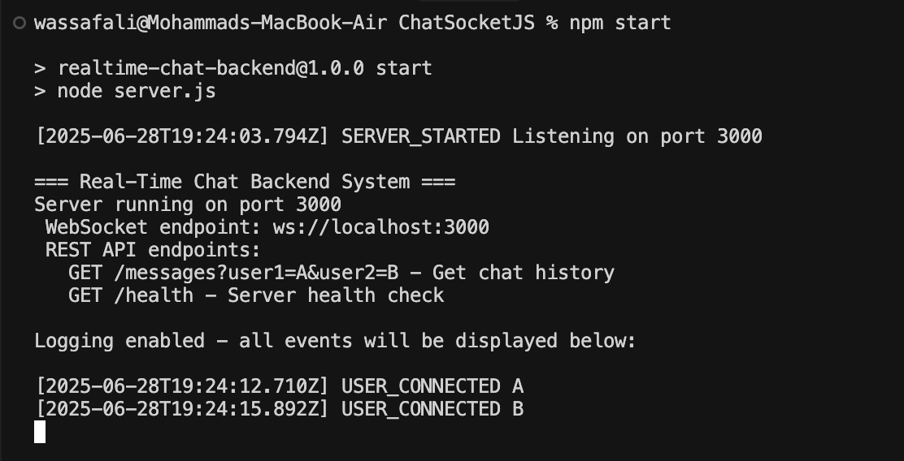

# ChatSocketJS - Real-Time Chat Backend


*Modern, lightweight, and high-performance chat backend for real-time messaging.*

---

## 🚀 Overview
ChatSocketJS is a Node.js-based backend for building real-time chat applications. It features:
- **Real-time messaging** via WebSockets
- **Offline message queuing** and delivery
- **Persistent chat history** via REST API
- **Delivery confirmations** and reconnection handling

---

## 🖥️ Live Demo Screenshots

### 1. Automated Test Suite

*All core chat features are covered by automated tests.*

### 2. Server Startup & API Endpoints

*Server logs show startup, endpoints, and user connections.*

### 3. Client A Chat Session

*User A sending and receiving messages in real time.*

### 4. Client B Chat Session

*User B participating in the chat, with message history and delivery.*

---

## ⚡ Quick Start

### Prerequisites
- Node.js 14+
- npm or yarn

### Setup
```bash
npm install
npm start
```
The server runs on port 3000 by default. Logs will show connections, messages, and system events.

### Testing with Multiple Clients
Open two terminals:
```bash
npm run clientA   # Terminal 1 (User A)
npm run clientB   # Terminal 2 (User B)
```

---

## 💬 How to Use the Chat Clients
- **Send messages:** `B:Hello there!` (from A to B)
- **View chat history:** `history B`
- **Disconnect:** `quit`

---

## 🔑 Key Features

### Real-Time Messaging
Instant delivery when both users are online via WebSockets.

### Offline Message Handling
Messages sent to offline users are queued and delivered upon reconnection.

### Message Acknowledgment
Each message has a unique ID and delivery confirmation.

### Chat History
All messages are stored in memory and accessible via REST API.

---

## 📚 API Reference

### WebSocket Endpoint
```
ws://localhost:3000?userId=YOUR_USER_ID
```

### REST Endpoints
- **Get Chat History:**
  ```http
  GET /messages?user1=Alice&user2=Bob
  ```
- **Health Check:**
  ```http
  GET /health
  ```

---

## 🧪 Testing Scenarios

### Basic Chat Flow
1. Start the server: `npm start`
2. Connect two clients: `npm run clientA` and `npm run clientB`
3. Exchange messages
4. Verify real-time delivery

### Offline Message Testing
1. Start server and both clients
2. Send messages
3. Disconnect one client
4. Send messages to the disconnected user
5. Reconnect and watch messages arrive

### API Testing
```bash
curl "http://localhost:3000/messages?user1=A&user2=B"
curl "http://localhost:3000/health"
```

---

## 🏗️ Architecture Overview
- **User Connections:** Active WebSocket map
- **Message Queue:** Buffered for offline users
- **Chat History:** In-memory storage
- **Message IDs:** Unique for tracking

All operations are event-driven for efficiency and thread safety.

---

## 🛠️ Development Notes
- **Logging:** Connection events, delivery status, errors, health
- **Error Handling:** Invalid formats rejected, failures logged
- **Performance:** In-memory for speed (data loss on restart), guaranteed message order

---

## 🤝 Contributing
Pull requests and issues are welcome! Please open an issue to discuss major changes.

---

## 📄 License
MIT
